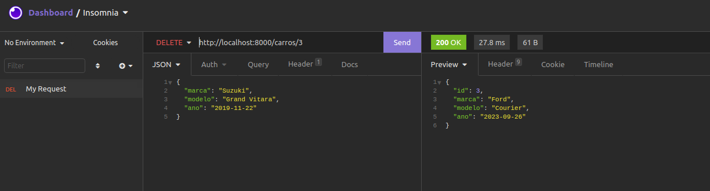

# Teste PHX
Teste PHX.
Instruções de execução deste teste: **[instruções](./docs/etapa_final.txt)**

 <br />  

> Essa aplicação foi desenvolvidada e testada no ambiente Ubuntu 21.10
# Requisitos
* [PHP>=7.4.24](https://www.php.net/downloads.php)
* [Composer>=2.0.14](https://getcomposer.org/download/)
* [MySql>=5.7](https://www.mysql.com/downloads/)
* [Docker](https://docs.docker.com/get-docker/) (Opcional)


# Setup
```sh
git clone https://github.com/stdioh321/teste-phx.git
cd teste-phx

# Instalar as dependencias do laravel
composer install

# Configurar o mysql
# Criar o banco de dados da aplicaçao e o de testes
# Talves esse comando precise da senha de root.

# mysqladmin create -p[SENHA_ROOT] phx
mysqladmin create phx
mysqladmin create phx_test

# Trocar a senha do usuario root para ser a mesma do .env e .env.testing
mysql -uroot -e "ALTER USER 'root'@'localhost' IDENTIFIED BY 'root';"  
mysql -uroot -proot -e "FLUSH PRIVILEGES;"


# Efetuar as migrations e seeders.
php artisan migrate
php artisan db:seed
```
|migrate/see|
|:--|
||


# Como rodar
```sh
php artisan serve
```
A aplicação deve rodar na url: **http://localhost:8000/carros**
|/carros [GET]|/carros/{id} [GET]|/carros/{id} [GET] id incorreto|
|:--|:--|:--|
|||

|/carros [POST]|/carros [POST] json incorreto|
|:--|:--|
||

|/carros/{id} [PUT]|/carros/{id} [PUT] json incorreto|
|:--|:--|
||

|/carros/{id} [DELETE]|/carros/{id} [DELETE] id incorreto|
|:--|:--|
||

# Testes
A aplicação possui alguns testes com phpunit.

```sh
./vendor/bin/phpunit
```
|Teste|
|:---|
||


# Documentação (OpenApi + Swagger)
Para essa aplicação foi adiciona uma documentação utilizando o **OpenApi + Swagger**.

> Para a documentação funcione corretamente é necessário que as migrations e seeders já tenham sido efetuadas.

Abra o navegador na url: **http://localhost:8000/api/documentation**


|Index|GET por id|
|:--|:--|
||

|POST com dados incorretos|PUT|
|:--|:--|
|||


|DELETE|
|:--| 
||

# Rodar com Docker

```sh
# Criar a imagem que possui o laravel e mysql utilizando o Dockerfile
docker build -t teste-phx .

# Rodar o container na porta 8001
docker run -p8001:80 -it teste-phx
```
Abra no navegador: **http://localhost:8001/carros**


|Terminal|Browser|
|:---|:---|
||

# Referencias
* https://github.com/lucascudo/laravel-pt-BR-localization
* https://seucarro.net/marcas-e-modelos-de-automoveis/
* https://developpaper.com/using-swagger-in-laravel-5-6/
* https://editor.swagger.io/